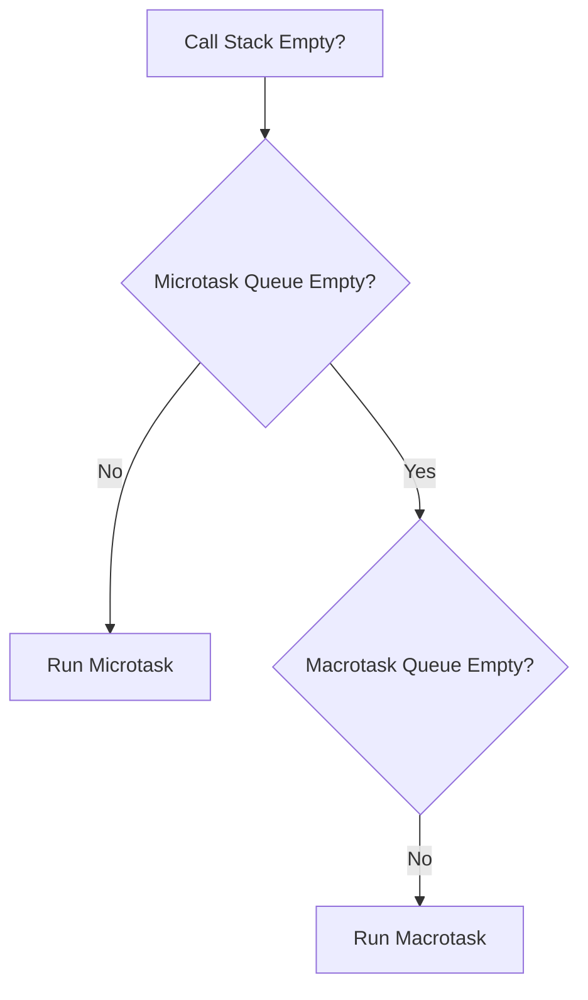

# 🔹 Microtask vs Macrotask Queue in JS 

### ✅ Definition:

JavaScript mein async tasks ko 2 queues mein daala jaata hai:

| Queue Type     | Examples                    | Execution Priority |
|----------------|-----------------------------|--------------------|
| **Microtask**  | Promises, `queueMicrotask()`| 🔥 Higher           |
| **Macrotask**  | setTimeout, setInterval     | 🕒 Lower            |

---

### 🔄 Flow Diagram:



### ⚠️ Important Rule:
Microtask Queue hamesha pehle execute hoti hai, jab call stack empty ho jaye.

### 🧠 Example:
```js
console.log("Start");

setTimeout(() => {
  console.log("setTimeout ✅");
}, 0);

Promise.resolve().then(() => {
  console.log("Promise ✅");
});

console.log("End");
```

### Output:
```js
Start
End
Promise ✅
setTimeout ✅
```